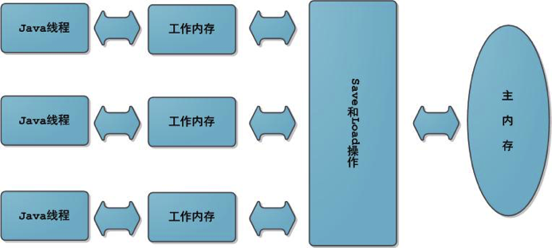

**java 虚拟机内存模型说明**

**基本回收算法**
引用计数（Reference Counting）
比较古老的回收算法，原理是此对象有一个引用，即增加一次计数，删除一个引用则减少一次计数。垃圾回收时，只会回收计数为0 的对象。
此算法最致命的是无法处理循环引用的问题。
**标记-清除**
此算法执行分为两阶段。第一阶段从引用根节点开始标记所引用对的对象。第二阶段遍历整个堆。把未标记的对象清除掉。
此算法需要暂停整个应用，同时还会产生内存碎片。
**复制**
此算法是将内存划分为相等的两个区，每次只使用一个区。垃圾回收时，遍历当前使用区域，把正在使用的对象复制到另外一个堆中，
，此算法每次只回收正在使用到的中的对象，因此复制成本比较小，同时复制过去还能进行相应的内存整理，不会出现碎片问题。此算法的
确定非常明显。就是需要占用两倍内存空间。
**标记-整理 （Mark-Compact）**
此算法结合标记清除和复制两个算法的优点，分为两个阶段，第一阶段从跟节点开始标记所有引用的对象，第二阶段遍历整个堆
把清除未标记对象并且把存活对象压缩到堆的其中一块。按照顺序排放。此算法避免标记清除   的碎片问题同时避免了复制算法空间占用的问题
**增量收集**
实施堆收集算法，及在应用进行垃圾回收。

**分代**
基于对象生命周期分析后得出的垃圾回收算法。吧对象分为年轻代，老年代，持久代，对对象不同的使用不同的算法。

**分代回收详述**
Young (年轻代)

年轻代分为三个区 一个Eden 区，两个Suqrvivor 区。大部分对象都在Eden区生成。当Eden区满时，还存活的对象将被复制到Survivor区（两个其中一个）。当这个 Survivor  也沾满时，从第一个Survivor 复制过去的并且此时还存活的对象将被复制到年老区（tenured）   需要注意Survivior  两个区是对称的。没有先后关系，所以同一个局域中可能同时保存到eden 复制过来的对象，和从前一个Survivor 复制过来的对象，而且到年老区只有一个Survivor ，而且总有一个区域是空的。

**年老代**

年老代是从年轻代中复制存活过来的对象。一般来说年老代中存活的都是生命周期比较长的对象。

**持久代**

用于存放静态文件，Java类，方法等。持久代对垃圾回收没有明显影响。但是有些应用程序可能动态生成或者调用UI写class 需要设置较大的持久代空间保存运行过程中的新增的类，持久代通过-XX:MaxPermSize = 进行设置。

GC 类型

GC 有两种类型。Scavengee GC 和Full   GC。

Scavenge GC 一般情况下，当新象生成。并且在Eden申请空间失败时，就会触发Scavenge  GC 堆Eden 区域进行GC 清除非存活对象。并且把尚且存活的对象移动到Survivor 区。然后整理Survivor两个区。

Full  GC :

对整个堆进行整理	，包括Young ,Tenured 和Perm 。Full  GC 比Scavenge GC 要慢。因此应该尽可能减少Full  GC。清除非存活对象。

因此减少Full  GC    。导致Full GC  有可能有如下原因：

Tenured被写满。Perm 区域被写满，System.gc()被显示调用。上一次GC 之后Heap 的各区域分配动态变化。

**垃圾回收器**

目前的收集器主要有三种：串行收集器，并行收集器，并发收集器。

串行收集器：使用单线程处理所有垃圾回收工作。因为无需多线程交互使用,所以效率比较高。但是，无法使用多处理器。。当然 此收集器也可以用小数据量（100M） 情况下的多处理器上。可以使用-XX:+UseSerialGC 打开。

**并行收集器**

对年轻代进行并行垃圾回收。因此可以减少垃圾回收时间。一般在多线程处理器上使用：-XX:+UseParalledGC，打开。1. 使用-XX:ParallelGCThreads=设置并行垃圾回收的线程数。此值可以设置与机器处理器数量相等。

最大垃圾回收暂停：指定垃圾回收的最长暂停时间，通过 -XX:MaxGCPauseMillis=指定  单位毫秒。

吞吐量：吞吐量为垃圾回收时间与非垃圾回收时间的比值。通过-XX：GCTimeRatio 来设定。

**并发收集器**

可以保证大部分工作都并发进行（应用不用暂停）垃圾回收只暂停很少时间，此收集器在要求比较大的大规模项目中应用。使用 -XX:+UseConcMarkSweepGC 。

1.集中主要减少少年代的暂停是时间。

收集器使用

串行处理器： 数据量比较少（100M） 左右。单处理器下并且对响应时间无要求的应用。

并行处理器，“对吞吐量有高要求”，多CPU、对应用响应时间无要求的中、大型应用。举例：后台处理、科学计算。 --缺点：应用响应时间可能较长

并发处理

```
适用情况：“对响应时间有高要求”，多CPU、对应用响应时间有较高要求的中、大型应用。
```

```
典型配置：
java -Xmx3550m -Xms3550m -Xmn2g -Xss128k -XX:ParallelGCThreads=20 -XX:+UseConcMarkSweepGC -XX:+UseParNewGC
-XX:+UseConcMarkSweepGC：设置年老代为并发收集。测试中配置这个以后，-XX:NewRatio=4的配置失效了，原因不明。所以，此时年轻代大小最好用-Xmn设置。
-XX:+UseParNewGC:设置年轻代为并行收集。可与CMS收集同时使用。JDK5.0以上，JVM会根据系统配置自行设置，所以无需再设置此值。
java -Xmx3550m -Xms3550m -Xmn2g -Xss128k -XX:+UseConcMarkSweepGC -XX:CMSFullGCsBeforeCompaction=5 -XX:+UseCMSCompactAtFullCollection
-XX:CMSFullGCsBeforeCompaction：由于并发收集器不对内存空间进行压缩、整理，所以运行一段时间以后会产生“碎片”，使得运行效率降低。此值设置运行多少次GC以后对内存空间进行压缩、整理。
-XX:+UseCMSCompactAtFullCollection：打开对年老代的压缩。可能会影响性能，但是可以消除碎片
辅助信息
JVM提供了大量命令行参数，打印信息，供调试使用。主要有以下一些：
-XX:+PrintGC
输出形式：[GC 118250K->113543K(130112K), 0.0094143 secs]
                [Full GC 121376K->10414K(130112K), 0.0650971 secs]

-XX:+Printetails
输出形式：[GC [DefNew: 8614K->781K(9088K), 0.0123035 secs] 118250K->113543K(130112K), 0.0124633 secs]
                [GC [DefNew: 8614K->8614K(9088K), 0.0000665 secs][Tenured: 112761K->10414K(121024K), 0.0433488 secs] 121376K->10414K(130112K), 0.0436268 secs]

-XX:+PrintGCTimeStamps -XX:+PrintGC：PrintGCTimeStamps可与上面两个混合使用
输出形式：11.851: [GC 98328K->93620K(130112K), 0.0082960 secs]
-XX:+PrintGCApplicationConcurrentTime:打印每次垃圾回收前，程序未中断的执行时间。可与上面混合使用
输出形式：Application time: 0.5291524 seconds
-XX:+PrintGCApplicationStoppedTime：打印垃圾回收期间程序暂停的时间。可与上面混合使用
输出形式：Total time for which application threads were stopped: 0.0468229 seconds
-XX:PrintHeapAtGC:打印GC前后的详细堆栈信息
```

JVM  调优总结   + jstat 分析


```shell
jstat -gccause pid 1 
jstat -gccause pid 2000 每格2秒输出
输出信息说明：
S0: -Heap 上的Survivor space 0 区已经占用空间的百分比 
s1: -Heap 上的Survivor space 1 区已经使用空间的百分比
YGC - 从应用程序启动到采样发生Young GC 的次数信息
FGC - 从应用启动到采样到采样发生Full GC 的次数。
FGCT - 从应用启动到采样时Full GC 所启动的时间（单位秒）
YGCT - 从应用启动到采样Young GC 所使用的时间（单位秒）
GCT - 从应用启动到采样时用于垃圾回收时的时间  单位秒
```

**调优总结**

```j
年轻代大小选择
响应时间优先的应用：尽可能设大，直到接近系统的最低响应时间限制（根据实际情况选择）。在此种情况下，年轻代收集发生的频率也是最小的。同时，减少到达年老代的对象。
吞吐量优先的应用：尽可能的设置大，可能到达Gbit的程度。因为对响应时间没有要求，垃圾收集可以并行进行，一般适合8CPU以上的应用。
年老代大小选择
响应时间优先的应用：年老代使用并发收集器，所以其大小需要小心设置，一般要考虑并发会话率和会话持续时间等一些参数。如果堆设置小了，可以会造成内存碎片、高回收频率以及应用暂停而使用传统的标记清除方式；如果堆大了，则需要较长的收集时间。最优化的方案，一般需要参考以下数据获得：
并发垃圾收集信息
持久代并发收集次数
传统GC信息
花在年轻代和年老代回收上的时间比例
减少年轻代和年老代花费的时间，一般会提高应用的效率

吞吐量优先的应用：一般吞吐量优先的应用都有一个很大的年轻代和一个较小的年老代。原因是，这样可以尽可能回收掉大部分短期对象，减少中期的对象，而年老代尽存放长期存活对象。
较小堆引起的碎片问题
因 为年老代的并发收集器使用标记、清除算法，所以不会对堆进行压缩。当收集器回收时，他会把相邻的空间进行合并，这样可以分配给较大的对象。但是，当堆空间 较小时，运行一段时间以后，就会出现“碎片”，如果并发收集器找不到足够的空间，那么并发收集器将会停止，然后使用传统的标记、清除方式进行回收。如果出 现“碎片”，可能需要进行如下配置：
-XX:+UseCMSCompactAtFullCollection：使用并发收集器时，开启对年老代的压缩。
-XX:CMSFullGCsBeforeCompaction=0：上面配置开启的情况下，这里设置多少次Full GC后，对年老代进行压缩
```

jstat ：对VM内存使用量进行监控。  

jstat -class pid 显示加载class 的数量 及其所占用的空间等信息。

jstat -compiler pid 显示VM 实时编译的数量等信息。

 jstat -gc pid:可以显示gc的信息，查看gc的次数，及时间。其中最后五项，分别是young gc的次数，young gc的时间，full gc的次数，full gc的时间，gc的总时间。  

 jstat -gccapacity:可以显示，VM内存中三代（young,old,perm）对象的使用和占用大小，如：PGCMN显示的是最小perm的内存使用量，PGCMX显示的是perm的内存最大使用量，PGC是当前新生成的perm内存占用量，PC是但前perm内存占用量。其他的可以根据这个类推， OC是old内纯的占用量。  

  jstat -gcnew pid:new对象的信息。 

  jstat -gcnewcapacity pid:new对象的信息及其占用量。     

 jstat -gcold pid:old对象的信息。     

 jstat -gcoldcapacity pid:old对象的信息及其占用量。     

 jstat -gcpermcapacity pid: perm对象的信息及其占用量。     

 jstat -util pid:统计gc信息统计。     

 jstat -printcompilation pid:当前VM执行的信息。 

 

# jdk8：jstat命令使用

jstat -class pid

- Loaded:加载class的数量

- Bytes：所占用空间大小

- Unloaded：未加载数量

- Bytes:未加载占用空间

- Time：时间

  jstat -gc pid 

  S0C：第一个幸存区的大小
  S1C：第二个幸存区的大小
  S0U：第一个幸存区的使用大小
  S1U：第二个幸存区的使用大小
  EC：伊甸园区的大小
  EU：伊甸园区的使用大小
  OC：老年代大小
  OU：老年代使用大小
  MC：方法区大小
  MU：方法区使用大小
  CCSC:压缩类空间大小
  CCSU:压缩类空间使用大小
  YGC：年轻代垃圾回收次数
  YGCT：年轻代垃圾回收消耗时间
  FGC：老年代垃圾回收次数
  FGCT：老年代垃圾回收消耗时间

  GCT：垃圾回收消耗总时间 

  输出参数说明
  
  **常见配置汇总**
  堆设置
  -Xms:初始堆大小
  -Xmx:最大堆大小
  -XX:NewSize=n:设置年轻代大小
  -XX:NewRatio=n:设置年轻代和年老代的比值。如:为3，表示年轻代与年老代比值为1：3，年轻代占整个年轻代年老代和的1/4
  -XX:SurvivorRatio=n:年轻代中Eden区与两个Survivor区的比值。注意Survivor区有两个。如：3，表示Eden：Survivor=3：2，一个Survivor区占整个年轻代的1/5
  -XX:MaxPermSize=n:设置持久代大小
  收集器设置
  -XX:+UseSerialGC:设置串行收集器
  -XX:+UseParallelGC:设置并行收集器
  -XX:+UseParalledlOldGC:设置并行年老代收集器
  -XX:+UseConcMarkSweepGC:设置并发收集器
  垃圾回收统计信息
  -XX:+PrintGC
  -XX:+PrintGCDetails
  -XX:+PrintGCTimeStamps
  -Xloggc:filename
  并行收集器设置
  -XX:ParallelGCThreads=n:设置并行收集器收集时使用的CPU数。并行收集线程数。
  -XX:MaxGCPauseMillis=n:设置并行收集最大暂停时间
  -XX:GCTimeRatio=n:设置垃圾回收时间占程序运行时间的百分比。公式为1/(1+n)
  
  
 堆内存划分阶段

</img>

**内存划分(jdk1.7 内存模型)**

 在jdk1.8 中Perm  被metaspace 所取代

</img>

**G1垃圾回收算法**

GarBage First 简称G1

目标是要求减少GC 所导致的应用暂停的时间，让应用达到准时的效果。同时保证JVMd

堆空间大的利用率。，最大最大的特色在于永许在制定的时间内GC所导致的GC所导致的

应用暂停的时间为1秒。这个特性对于准时保证系统响应时间的系统非常具有吸引力。

G1 要求 一方面是硬件环境达到这样的要求，必须是多核较大内存（规范上讲512M）

就达到了要求。另一方面是接受吞吐量稍微的降低。对于实时性要求较高的系统而言。

这点是可以接受的。

G1  吸收了原有GC以及CMS的精髓。将整个jvm Heap 分成 几个固定大小的region

扫描时采用Snapshot-at-the-beginning的并发marking算法（具体在后面内容详细解释）对整个heap中的region进行mark，回收时根据region中活跃对象的bytes进行排序，首先回收活跃对象bytes小以及回收耗时短（预估出来的时间）的region，回收的方法为将此region中的活跃对象复制到另外的region中，根据指定的GC所能占用的时间来估算能回收多少region，这点和以前版本的Full GC时得处理整个heap非常不同，这样就做到了能够尽量短时间的暂停应用，又能回收内存，由于这种策略在回收时首先回收的是垃圾对象所占空间最多的region，因此称为Garbage First。

 **Tomcat内存调优**
 Tomcat内存参数信息
 1 -server 一定要作为第一个参数，在多核CPU下性能最佳
 2 -Xms Java heap 初始大小，默认是物理内存的1/64  
 3 -Xmx java heap最大值。建议均设为物理内存的一半。不可超过物理内存。
 4 -XX:PermSize：设定内存的永久保存区初始大小。缺省值为64M。(1.7)
 5 -XX:MaxPermSize：设定内存的永久保存区最大 大小。缺省值为64M。
 6 -Xmn：young generation(年轻代)的heap大小。一般设置为Xmx的3、4分之一
 
 新建 setenv.sh   执行脚本并且设置
 export JAVA_OPTS=" -server -Xms4g -Xmx4g -Xmn1g"
 
 
 主要通过以下的几个jvm参数来设置堆内存的：
 -Xmx512m	最大总堆内存，一般设置为物理内存的1/4
 -Xms512m	初始总堆内存，一般将它设置的和最大堆内存一样大，这样就不需要根据当前堆使用情况而调整堆的大小了
 -Xmn192m	年轻带堆内存，sun官方推荐为整个堆的3/8
 堆内存的组成	总堆内存 = 年轻带堆内存 + 年老带堆内存 + 持久带堆内存
 年轻带堆内存	对象刚创建出来时放在这里
 年老带堆内存	对象在被真正会回收之前会先放在这里
 持久带堆内存	class文件，元数据等放在这里
 -XX:PermSize=128m	持久带堆的初始大小
 -XX:MaxPermSize=128m	
 持久带堆的最大大小，eclipse默认为256m。如果要编译jdk这种，一定要把这个设的很大，因为它的类太多了。
